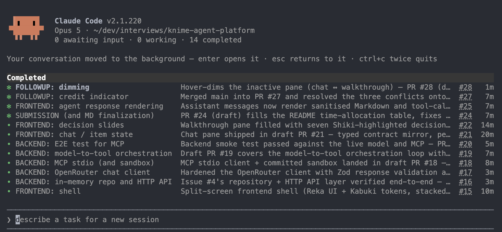

# Agentic Chat: KNIME Full-Stack Exercise

A vertical slice of an agentic chat app: a Vue frontend talks to a Node/TypeScript backend,
which orchestrates an OpenRouter model and an MCP server and returns structured conversation
items.

```
frontend/   Vue 3 + TypeScript (Vite)   chat UI, tool-usage indicator, error states, walkthrough
backend/    Node 22 + TypeScript        HTTP API, model <-> tool orchestration, MCP client
sandbox/    Seed files the MCP filesystem server is allowed to touch
docs/adr/   Architecture decision records
docs/       MCP research notes and the recorded end-to-end smoke test
```

The frontend is a split screen: the chat on the right, and a walkthrough beside it. Seven
slides, one for each technical requirement in the brief plus an opener and two on what was left
out and what comes next, each pairing a decision with the code behind it. It's there because
the exercise gets presented as well as read ([ADR 0005](docs/adr/0005-walkthrough-pane.md)).
The chat is the app, though, and it was finished before any of the walkthrough existed.

The per-side READMEs go deeper: [backend/README.md](backend/README.md) covers layering,
branded ids, and the orchestration loop; [frontend/README.md](frontend/README.md) covers the
UI structure.

## Running it

Prerequisites: Node 22.18+ (or 24.12+), `npm`, and `pnpm`.

```bash
make install
```

Then fill in `backend/.env` (created for you from `.env.example`):

| Variable               | Notes                                                                       |
| ---------------------- | --------------------------------------------------------------------------- |
| `OPENROUTER_API_KEY`   | The provided key. **Never commit this.**                                    |
| `OPENROUTER_MODEL`     | `vendor/model` slug, e.g. `anthropic/claude-sonnet-4.5`                     |
| `OPENROUTER_BASE_URL`  | Defaults to `https://openrouter.ai/api/v1`                                  |
| `MCP_TRANSPORT`        | `stdio` (default) or `http`. Picks which of the vars below are read          |
| `MCP_COMMAND`/`_ARGS`  | How to launch the MCP server. Pre-filled; `MCP_ARGS` is a JSON array         |
| `MCP_SANDBOX_DIR`      | The server's allowed root. Blank uses the committed `sandbox/`               |
| `MCP_SERVER_URL`       | Only read when `MCP_TRANSPORT=http`. Nothing in the demo setup uses it       |
| `MAX_TOOL_ITERATIONS`  | Model↔tool round trips per user message (default 5)                         |
| `PORT`, `CORS_ORIGIN`  | Backend port and the allowed frontend origin                                |

Only `OPENROUTER_API_KEY` actually has to be filled in. The MCP defaults launch the
filesystem server against `sandbox/` with no further setup, and the first boot is a few
seconds slower while `npx` fetches the server package.

The frontend takes no setup. It reads `VITE_API_BASE_URL` if you set one and otherwise
assumes `http://localhost:3000`, which is where `make dev` puts the backend. If you do move
the backend, keep `CORS_ORIGIN` in step with wherever the frontend ends up.

```bash
make dev
```

Backend on `http://localhost:3000`, frontend on `http://localhost:5173`.
`make check` runs type-check and lint on both sides and then the tests; `make test` runs just
the tests, and `make help` lists everything.

Broad test coverage is out of scope, so there are 36 tests aimed at three seams that would be
expensive to get wrong: the orchestration loop, the projection into provider messages, and the
HTTP layer. The model and the MCP server are faked throughout, so the whole thing runs with no
network, no provider key and no spawned child process. See
[backend/README.md](backend/README.md#running) for what's deliberately left uncovered.

Config is validated at boot in `backend/src/config/env.ts`. A missing or malformed variable
stops the process with a readable message rather than failing on the first request.

## Model and MCP tool

| | |
| --- | --- |
| **Model** | `anthropic/claude-sonnet-4.5` via OpenRouter's OpenAI-compatible `/chat/completions` |
| **MCP server** | [`@modelcontextprotocol/server-filesystem`](https://www.npmjs.com/package/@modelcontextprotocol/server-filesystem) `2026.7.10`, launched over **stdio**, rooted at `sandbox/` |
| **Tools exercised** | `list_allowed_directories`, `list_directory`, `search_files`, `read_text_file`. The server exposes 14, of which 13 are discovered and offered |

The model is environment-configurable and never hardcoded. Tools are not hardcoded either:
the backend calls `tools/list` on the MCP server at boot and passes whatever it finds to the
model, so swapping the MCP server requires no code change. The one tool held back is
`read_file`, a deprecated alias whose handler is literally `read_text_file`'s (offering both
just invites the wrong pick and costs tokens on every request).

The server version is pinned because the package uses CalVer and its tool set has changed
across releases. `sandbox/` is committed with a few seed files (notes, a CSV, a checklist) so
a fresh clone has something to read. Ask _"which region had the highest Q2 revenue?"_ and the
model has to list, search, read and then reason over the CSV, which is a much better exercise
of the loop than a single lookup. The server can write and delete inside that directory and
refuses every path outside it, symlinks included.
[ADR 0004](docs/adr/0004-filesystem-mcp-over-stdio.md) has the rest of the reasoning.

## Architecture

```
Vue app ──HTTP/JSON──> Express API ──> ChatService ──> OpenRouter (chat completions)
                                            │
                                            └──────> MCP client (tools/list, tools/call)
```

The backend is layered `api → service → repository → domain`, with dependencies pointing
inward and every cross-layer collaborator behind an interface (`LlmClient`, `ToolProvider`,
`ConversationRepository`). `container.ts` is the composition root. See
[backend/README.md](backend/README.md#layers).

### API

| Method | Path                              | Purpose                                          |
| ------ | --------------------------------- | ------------------------------------------------ |
| `GET`  | `/health`                         | Liveness + active model                          |
| `POST` | `/api/conversations`              | Create a conversation → `{ id, items }`          |
| `GET`  | `/api/conversations/:id`          | Full conversation                                |
| `POST` | `/api/conversations/:id/messages` | Send `{ content }` → the items this turn produced |
| `GET`  | `/api/credits`                    | Provider spend: `{ usage, limit, remaining, scope }` |

### Conversation items

One discriminated union shared by both sides
(`backend/src/domain/conversation-item.ts`):

`user_message` · `assistant_message` · `tool_call` · `tool_result` · `error`

`POST /messages` returns only the items that turn produced, in the order they happened, so
the frontend appends them and renders tool activity inline. `tool_call` and `tool_result`
are linked by `toolCallId`.

### Orchestration flow

1. Append the `user_message` item.
2. Project the conversation into provider messages. `error` items are deliberately not
   replayed to the model.
3. Call OpenRouter with the discovered MCP tool list.
4. No tool calls → append `assistant_message`, done.
5. Tool calls → append `tool_call`, execute via MCP, append `tool_result`, loop from step 2.
6. Bounded by `MAX_TOOL_ITERATIONS`; exceeding it appends an `error` item.

## Design decisions and trade-offs

The ones that were genuinely arguable have a fuller write-up in [`docs/adr/`](docs/adr/); the
rest are linked to the code that explains them.

- **Node/TypeScript backend instead of Go or Java.** The brief prefers Go or Java; within a
  4–6 hour timebox one language across both sides buys a single shared conversation-item
  model and no context switching. The layering is the part that transfers, and it is
  framework-agnostic. — [ADR 0001](docs/adr/0001-node-typescript-backend.md)
- **Non-streaming request/response.** Token streaming is explicitly out of scope. Returning
  the turn's items as one array keeps the transport trivial and the item union honest; the
  same shape can later be emitted incrementally over SSE without changing the model. —
  [ADR 0002](docs/adr/0002-turn-shaped-responses.md)
- **Errors are conversation items, not failed requests.** A provider or MCP failure still
  returns 2xx, with an `error` item in the turn, so the UI renders it in the transcript
  instead of showing a dead request. A failing *tool* becomes a `tool_result` with `isError: true` so the model can
  recover on its own. — [ADR 0003](docs/adr/0003-errors-as-conversation-items.md)
- **In-memory repository behind an interface.** Persistence is out of scope, but the seam
  exists so swapping in a real store is a one-file change.
- **Branded ids.** Three UUID-shaped ids flow through the same call sites in the
  orchestrator; brands make mixing them a compile error at zero runtime cost.
- **The filesystem MCP server, over stdio, rooted at a committed sandbox.** It runs on a
  fresh clone with nothing to install by hand, and the seed files give the model something
  worth reasoning over. The session is opened once at boot and reused, discovery is cached for
  the session, and shutdown on `SIGINT`/`SIGTERM` reaps the child process. Startup fails loudly
  if the server is unreachable, which is the right trade for a single-instance app. —
  [ADR 0004](docs/adr/0004-filesystem-mcp-over-stdio.md)
- **A walkthrough pane beside the chat.** The brief asks for a minimal chat interface, and
  this is more than that. It exists because the exercise gets presented as well as read, so the
  demo and the argument for it may as well be the same artifact. It was built last, after the
  loop already worked end to end. — [ADR 0005](docs/adr/0005-walkthrough-pane.md)

## Out of scope

Per the brief: auth, persistence, multiple users/conversations, multiple providers, UI-based
config, token streaming, parallel tool calls, human approval, file uploads, deployment, and
broad test coverage.

## Time allocation

Roughly four-five hours.

| Area | Time |
| --- | --- |
| Design, scaffolding, project setup | 0:50 |
| Backend: domain model + layering | 0:35 |
| Backend: OpenRouter client | 0:20 |
| Backend: MCP client + tool loop | 0:50 |
| Frontend: chat UI and states | 0:40 |
| Frontend: walkthrough pane | 0:25 |
| Docs and cleanup | 0:20 |
| **Total** | **~4-5:00** |

The order matters more than the numbers. The design and the domain model came first, because
the conversation-item union is the contract both sides are built against and getting it wrong
later is expensive. The MCP client took the longest single stretch, which is the part I'd
expect: it's the only piece with a child process, a lifecycle and a security boundary to get
right, and the research behind it is in
[`docs/research/mcp-filesystem.md`](docs/research/mcp-filesystem.md).

The walkthrough pane was built last, deliberately. It's the one thing here that isn't asked
for, so it only got time once the loop worked end to end and had been smoke-tested against the
real model and the real server ([`docs/smoke-test.md`](docs/smoke-test.md)).

Special thanks to Claude Code with [Matt Pocock's skills](https://github.com/mattpocock/skills) for helping provide the actual code implementation in a reasonable amount of time.


